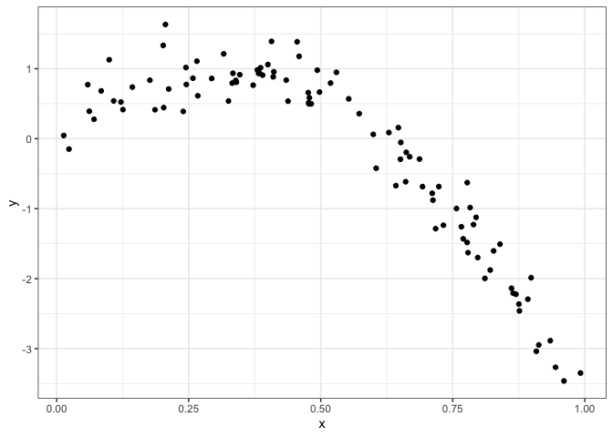
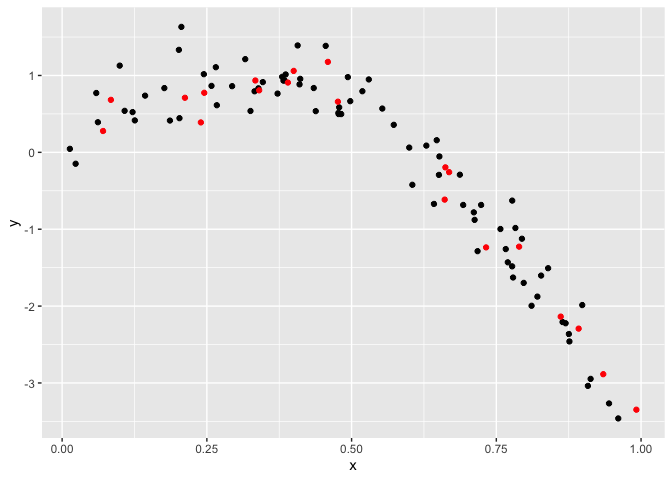
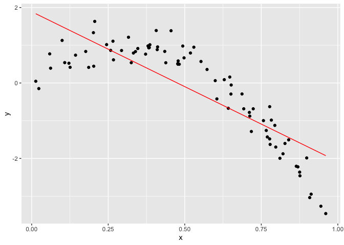
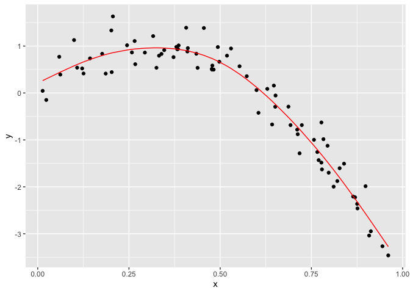
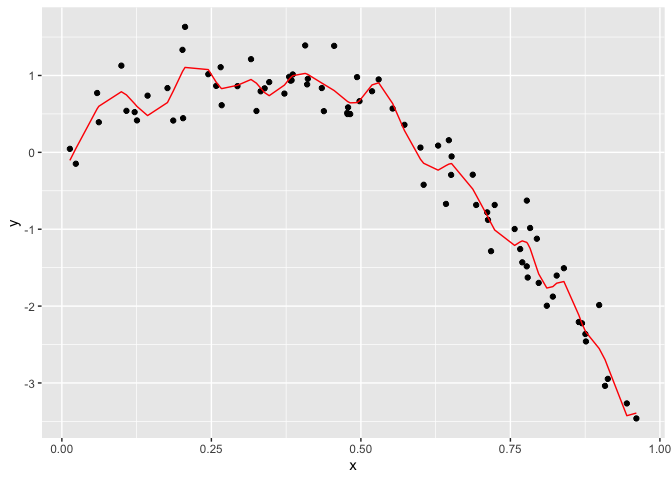
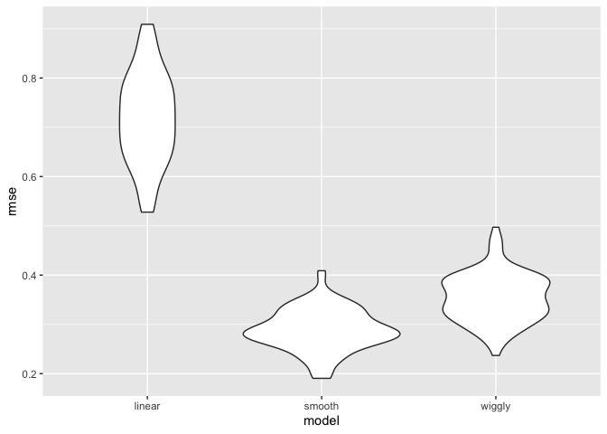
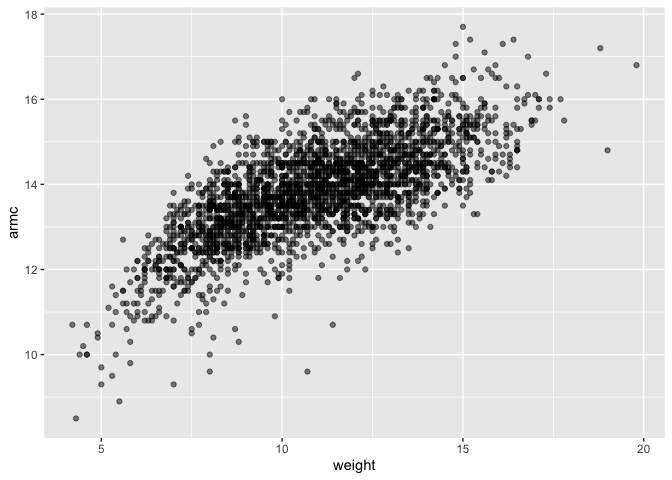
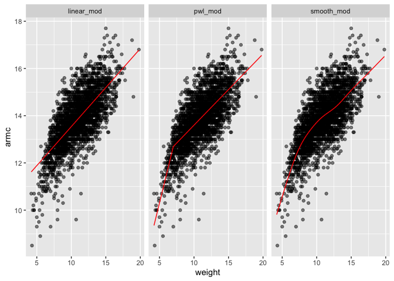
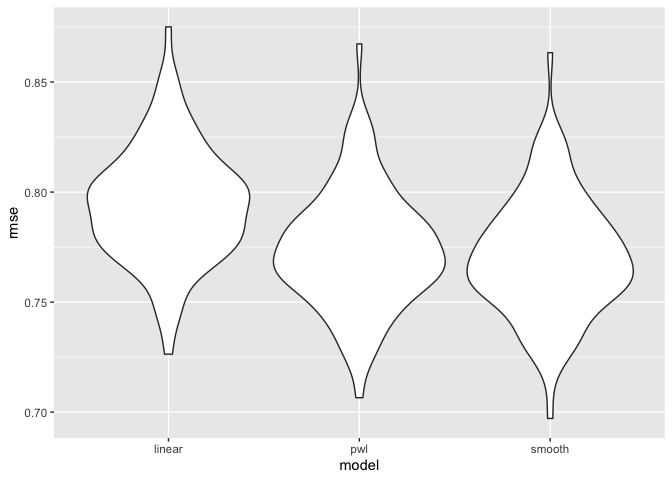

Cross Validation
================
Alice Tivarovsky
11/14/2019

# Slides

Model selection is hard, decide a priori what goes into your model.

If the model is nested, you can run some tests. If not, there are no
tests, but you can use AIC/BIC (balance goodness of fit and complexity).

Cross Validation: You split full dataset into training dataset and
testing dataset (usually an 80/20 split). Training is what you use to
build your model. Testing is how you evaluate fit. You evaluate the
model using the root mean squared error.

Cross validation can be used to compare traditional models, in which
case it boils down to AIC/BIC. It’s very popular in more modern modeling
methods (lasso, additive models, regression trees). Here, prediction is
the goal. Hypothesis testing is ok but prediction is a lot cooler.

Tools for cross-validation:

  - lots of helpful functions in modelr
      - add\_predictions() and add\_residuals()
      - rmse()
      - cross\_mc()

# Examples

Setup
    code

``` r
library(tidyverse)
```

    ## ── Attaching packages ──────────────────────────────────────── tidyverse 1.2.1 ──

    ## ✔ ggplot2 3.2.1     ✔ purrr   0.3.2
    ## ✔ tibble  2.1.3     ✔ dplyr   0.8.3
    ## ✔ tidyr   1.0.0     ✔ stringr 1.4.0
    ## ✔ readr   1.3.1     ✔ forcats 0.4.0

    ## ── Conflicts ─────────────────────────────────────────── tidyverse_conflicts() ──
    ## ✖ dplyr::filter() masks stats::filter()
    ## ✖ dplyr::lag()    masks stats::lag()

``` r
library(mgcv)
```

    ## Loading required package: nlme

    ## 
    ## Attaching package: 'nlme'

    ## The following object is masked from 'package:dplyr':
    ## 
    ##     collapse

    ## This is mgcv 1.8-29. For overview type 'help("mgcv-package")'.

``` r
library(modelr)

set.seed(1)
```

## Cross Validation

Generate a dataset. Thiis is a non-linear dataset, where a line doesn’t
quite cut it.

``` r
nonlin_df = 
  tibble(
    id = 1:100,
    x = runif(100, 0, 1),
    y = 1 - 10 * (x - .3) ^ 2 + rnorm(100, 0, .3)
  )

nonlin_df %>% 
  ggplot(aes(x = x, y = y)) + 
  geom_point() + theme_bw()
```

<!-- -->

Training and testing “by hand”.

I’ll split this data into training and test sets (using anti\_join\!\!),
and replot showing the split. Our goal will be to use the training data
(in black) to build candidate models, and then see how those models
predict in the testing data (in red).

``` r
train_df = sample_n(nonlin_df, 80)
test_df = anti_join(nonlin_df, train_df, by = "id")

ggplot(train_df, aes(x = x, y = y)) + 
  geom_point() + 
  geom_point(data = test_df, color = "red")
```

<!-- -->

Now we fit three models of varying goodness. I’ll fit three three models
to the training data. Throughout, I’m going to use mgcv::gam for
non-linear models – this is my go-to package for “additive models”, and
I much prefer it to e.g. polynomial models. For today, you don’t have to
know what this means, how gam works, or why I prefer it – just know that
we’re putting smooth lines through data clouds, and we can control how
smooth we want the fit to be.

The three models below have very different levels of complexity and
aren’t nested, so testing approaches for nested model don’t apply.

``` r
linear_mod = lm(y ~ x, data = train_df)
smooth_mod = mgcv::gam(y ~ s(x), data = train_df)
wiggly_mod = mgcv::gam(y ~ s(x, k = 30), sp = 10e-6, data = train_df)
```

Let’s plot these:

``` r
train_df %>% 
  add_predictions(linear_mod) %>% 
  ggplot(aes(x = x, y = y)) +
  geom_point() + 
  geom_line(aes(y = pred), color = "red")
```

<!-- -->

``` r
train_df %>% 
  add_predictions(smooth_mod) %>% 
  ggplot(aes(x = x, y = y)) + geom_point() + 
  geom_line(aes(y = pred), color = "red")
```

<!-- -->

``` r
train_df %>% 
  add_predictions(wiggly_mod) %>% 
  ggplot(aes(x = x, y = y)) + geom_point() + 
  geom_line(aes(y = pred), color = "red")
```

<!-- -->

A quick visual inspection suggests that the linear model is too simple,
the standard gam fit is pretty good, and the wiggly gam fit is too
complex. Put differently, the linear model is too simple and, no matter
what training data we use, will never capture the true relationship
between variables – it will be consistently wrong due to its simplicity,
and is therefore biased. The wiggly fit, on the other hand, is chasing
data points and will change a lot from one training dataset to the the
next – it will be consistently wrong due to its complexity, and is
therefore highly variable. Both are bad\!

As a next step in my CV procedure, I’ll compute root mean squared errors
(RMSEs) for each model. There are no p-values for the models. But the
root mean squared errors give us an idea of how far off the model is
from the points, on average. Here, the smooth model is the best.

``` r
rmse(linear_mod, test_df)
```

    ## [1] 0.7052956

``` r
rmse(smooth_mod, test_df)
```

    ## [1] 0.2221774

``` r
rmse(wiggly_mod, test_df)
```

    ## [1] 0.289051

The modelr has other outcome measures – RMSE is the most common, but
median absolute deviation is pretty common as well.

The RMSEs are suggestive that both nonlinear models work better than the
linear model, and that the smooth fit is better than the wiggly fit.
However, to get a sense of model stability we really need to iterate
this whole process. Of course, this could be done using loops but that’s
a hassle …

## CV Using modelr

Luckily, modelr has tools to automate elements of the CV process. In
particular, crossv\_mc preforms the training / testing split multiple
times, and stores the datasets using list columns.

The following generates 100 training/ testing pairs and stores them as
list columns in a data frame.

``` r
cv_df = 
  crossv_mc(nonlin_df, 100) 
```

You can see the list columns by doing:

``` r
cv_df %>% pull(train) %>% .[[3]] %>% as_tibble
```

    ## # A tibble: 79 x 3
    ##       id     x      y
    ##    <int> <dbl>  <dbl>
    ##  1     1 0.266  1.11 
    ##  2     2 0.372  0.764
    ##  3     3 0.573  0.358
    ##  4     4 0.908 -3.04 
    ##  5     5 0.202  1.33 
    ##  6     6 0.898 -1.99 
    ##  7     7 0.945 -3.27 
    ##  8    11 0.206  1.63 
    ##  9    12 0.177  0.836
    ## 10    13 0.687 -0.291
    ## # … with 69 more rows

But this is very helpful, so we map train and test as data frames
instead (?)

``` r
cv_df =
  cv_df %>% 
  mutate(
    train = map(train, as_tibble),
    test = map(test, as_tibble))
```

Try fitting a linear model to all of these and calculating the rmse for
each set.

``` r
cv_df %>% 
  mutate(
    linear_mods = map(.x = train, ~lm(y ~ x, data = .x)), 
    rmse_lin = map2_dbl(.x = linear_mods, .y = test, ~rmse(.x, .y))
  )
```

    ## # A tibble: 100 x 5
    ##    train             test              .id   linear_mods rmse_lin
    ##    <list>            <list>            <chr> <list>         <dbl>
    ##  1 <tibble [79 × 3]> <tibble [21 × 3]> 001   <lm>           0.675
    ##  2 <tibble [79 × 3]> <tibble [21 × 3]> 002   <lm>           0.655
    ##  3 <tibble [79 × 3]> <tibble [21 × 3]> 003   <lm>           0.785
    ##  4 <tibble [79 × 3]> <tibble [21 × 3]> 004   <lm>           0.874
    ##  5 <tibble [79 × 3]> <tibble [21 × 3]> 005   <lm>           0.784
    ##  6 <tibble [79 × 3]> <tibble [21 × 3]> 006   <lm>           0.844
    ##  7 <tibble [79 × 3]> <tibble [21 × 3]> 007   <lm>           0.791
    ##  8 <tibble [79 × 3]> <tibble [21 × 3]> 008   <lm>           0.758
    ##  9 <tibble [79 × 3]> <tibble [21 × 3]> 009   <lm>           0.621
    ## 10 <tibble [79 × 3]> <tibble [21 × 3]> 010   <lm>           0.839
    ## # … with 90 more rows

I now have many training and testing datasets, and I’d like to fit my
candidate models above and assess prediction accuracy as I did for the
single training / testing split. To do this, I’ll fit models and obtain
RMSEs using mutate + map & map2.

``` r
cv_df = 
  cv_df %>% 
  mutate(linear_mod  = map(train, ~lm(y ~ x, data = .x)),
         smooth_mod  = map(train, ~mgcv::gam(y ~ s(x), data = .x)),
         wiggly_mod  = map(train, ~gam(y ~ s(x, k = 30), sp = 10e-6, data = .x))) %>% 
  mutate(rmse_linear = map2_dbl(linear_mod, test, ~rmse(model = .x, data = .y)),
         rmse_smooth = map2_dbl(smooth_mod, test, ~rmse(model = .x, data = .y)),
         rmse_wiggly = map2_dbl(wiggly_mod, test, ~rmse(model = .x, data = .y)))
```

I’m mostly focused on RMSE as a way to compare these models, and the
plot below shows the distribution of RMSE values for each candidate
model.

``` r
cv_df %>% 
  select(starts_with("rmse")) %>% 
  pivot_longer(
    everything(),
    names_to = "model", 
    values_to = "rmse",
    names_prefix = "rmse_") %>% 
  mutate(model = fct_inorder(model)) %>% 
  ggplot(aes(x = model, y = rmse)) + geom_violin()
```

<!-- -->

Repeating the split is helpful – now we get a sense of variance in
prediction error and can compare prediction error distributions across
methods. The smooth fit is a clear winner\!

It’s worth remembering, though, that this isn’t testing a null
hypothesis and there aren’t p-values as a result.

## Example: Child Growth

We’ll take a quick look at an example involving real data and more
realistic candidate model. A cross-sectional study of Nepalese children
was carried out to understand the relationships between various measures
of growth, including weight and arm circumference. You can download the
data here; the code chunk below imports the data and plots the variables
we’ll focus on.

``` r
child_growth = read_csv("./data/nepalese_children.csv")
```

    ## Parsed with column specification:
    ## cols(
    ##   age = col_double(),
    ##   sex = col_double(),
    ##   weight = col_double(),
    ##   height = col_double(),
    ##   armc = col_double()
    ## )

``` r
child_growth %>% 
  ggplot(aes(x = weight, y = armc)) + 
  geom_point(alpha = .5)
```

<!-- -->

The plots suggests some non-linearity, especially at the low end of the
weight distribution. We’ll try three models: a linear fit; a piecewise
linear fit; and a smooth fit using gam. For the piecewise linear fit, we
need to add a “change point term” to our dataframe. (Like additive
models, for now it’s not critical that you understand everything about a
piecewise linear fit – we’ll see a plot of the results soon, and the
intuition from that is enough for our purposes.)

``` r
child_growth =
  child_growth %>% 
  mutate(weight_cp = (weight > 7) * (weight - 7))
```

The code chunk below fits each of the candidate models to the full
dataset. The piecewise linear model is nested in the linear model and
could be assessed using statistical significance, but the smooth model
is not nested in anything else. (Also, comparing a piecewise model with
a changepoint at 7 to a piecewise model with a changepoint at 8 would be
a non-nested comparison…)

``` r
linear_mod    = lm(armc ~ weight, data = child_growth)
pwl_mod    = lm(armc ~ weight + weight_cp, data = child_growth)
smooth_mod = gam(armc ~ s(weight), data = child_growth)
```

As before, I’ll plot the three models to get intuition for goodness of
fit.

``` r
child_growth %>% 
  gather_predictions(linear_mod, pwl_mod, smooth_mod) %>% 
  mutate(model = fct_inorder(model)) %>% 
  ggplot(aes(x = weight, y = armc)) + 
  geom_point(alpha = .5) +
  geom_line(aes(y = pred), color = "red") + 
  facet_grid(~model)
```

<!-- -->

It’s not clear which is best – the linear model is maybe too simple, but
the piecewise and non-linear models are pretty similar\! Better check
prediction errors using the same process as before – again, since I want
to fit a gam model, I have to convert the resample objects produced by
crossv\_mc to dataframes, but wouldn’t have to do this if I only wanted
to compare the linear and piecewise models.

``` r
cv_df =
  crossv_mc(child_growth, 100) %>% 
  mutate(
    train = map(train, as_tibble),
    test = map(test, as_tibble))
```

Next I’ll use mutate + map & map2 to fit models to training data and
obtain corresponding RMSEs for the testing data.

``` r
cv_df = 
  cv_df %>% 
  mutate(linear_mod  = map(train, ~lm(armc ~ weight, data = .x)),
         pwl_mod     = map(train, ~lm(armc ~ weight + weight_cp, data = .x)),
         smooth_mod  = map(train, ~gam(armc ~ s(weight), data = as_tibble(.x)))) %>% 
  mutate(rmse_linear = map2_dbl(linear_mod, test, ~rmse(model = .x, data = .y)),
         rmse_pwl    = map2_dbl(pwl_mod, test, ~rmse(model = .x, data = .y)),
         rmse_smooth = map2_dbl(smooth_mod, test, ~rmse(model = .x, data = .y)))
```

Finally, I’ll plot the prediction error distribution for each candidate
model.

``` r
cv_df %>% 
  select(starts_with("rmse")) %>% 
pivot_longer(
    everything(),
    names_to = "model", 
    values_to = "rmse",
    names_prefix = "rmse_") %>% 
  mutate(model = fct_inorder(model)) %>% 
  ggplot(aes(x = model, y = rmse)) + geom_violin()
```

<!-- -->

The smooth model is good, but the piecewise linear model is a bit nicer
because it has an easy interpretation.

just practice

# Other Materials

Cross validation is important, but still a bit new to the tidyverse.
Some helpful posts are available, though, including:

  - This
    [post](https://drsimonj.svbtle.com/k-fold-cross-validation-with-modelr-and-broom)
    has a pretty detailed analysis of K fold CV
  - [This](http://rpubs.com/dgrtwo/cv-modelr) is a shorter, somewhat
    more dated example The Introduction to Statistical Learning with R
    isn’t free online, but if you can track it down Chapter 5 has some
    useful material as well.
