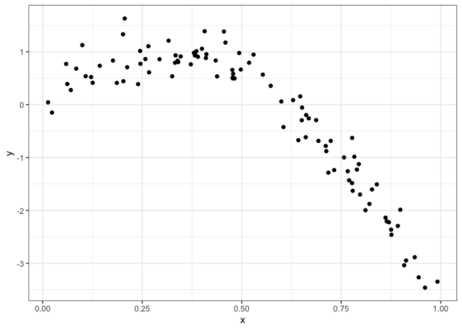
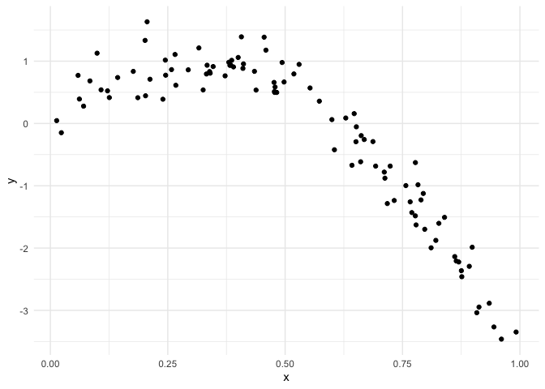

Cross Validation
================
Alice Tivarovsky
11/14/2019

# Slides

Model selection is hard, decide a priori what goes into your model.

If the model is nested, you can run some tests. If not, there are no
tests, but you can use AIC/BIC (balance goodness of fit and complexity).

Cross Validation: You split full dataset into training dataset and
testing dataset (usually an 80/20 split). Training is what you use to
build your model. Testing is how you evaluate fit. You evaluate the
model using the root mean squared error.

Cross validation can be used to compare traditional models, in which
case it boils down to AIC/BIC. It’s very popular in more modern modeling
methods (lasso, additive models, regression trees). Here, prediction is
the goal. Hypothesis testing is ok but prediction is a lot cooler.

Tools for cross-validation:

  - lots of helpful functions in modelr
      - add\_predictions() and add\_residuals()
      - rmse()
      - cross\_mc()

# Examples

Setup
    code

``` r
library(tidyverse)
```

    ## ── Attaching packages ───────────────────────────────────────────── tidyverse 1.2.1 ──

    ## ✔ ggplot2 3.2.1     ✔ purrr   0.3.2
    ## ✔ tibble  2.1.3     ✔ dplyr   0.8.3
    ## ✔ tidyr   1.0.0     ✔ stringr 1.4.0
    ## ✔ readr   1.3.1     ✔ forcats 0.4.0

    ## ── Conflicts ──────────────────────────────────────────────── tidyverse_conflicts() ──
    ## ✖ dplyr::filter() masks stats::filter()
    ## ✖ dplyr::lag()    masks stats::lag()

``` r
library(mgcv)
```

    ## Loading required package: nlme

    ## 
    ## Attaching package: 'nlme'

    ## The following object is masked from 'package:dplyr':
    ## 
    ##     collapse

    ## This is mgcv 1.8-29. For overview type 'help("mgcv-package")'.

``` r
library(modelr)

set.seed(1)

knitr::opts_chunk$set(
    echo = TRUE,
    warning = FALSE,
  out.width = "90%"
)
options(
  ggplot2.continuous.colour = "viridis",
  ggplot2.continuous.fill = "viridis"
)
scale_colour_discrete = scale_colour_viridis_d
scale_fill_discrete = scale_fill_viridis_d
theme_set(theme_minimal() + theme(legend.position = "bottom"))
```

## Cross Validation

Generate a dataset. Thiis is a non-linear dataset, where a line doesn’t
quite cut it.

``` r
nonlin_df = 
  tibble(
    id = 1:100,
    x = runif(100, 0, 1),
    y = 1 - 10 * (x - .3) ^ 2 + rnorm(100, 0, .3)
  )

nonlin_df %>% 
  ggplot(aes(x = x, y = y)) + 
  geom_point() + theme_bw()
```



Training and testing “by hand” I’ll split this data into training and
test sets (using anti\_join\!\!), and replot showing the split. Our goal
will be to use the training data (in black) to build candidate models,
and then see how those models predict in the testing data (in red).

``` r
train_df = sample_frac(nonlin_df, frac = 0.8)
test_df = anti_join(nonlin_df, train_df, by = "id")

ggplot(train_df, aes(x = x, y = y)) + 
  geom_point() + 
  geom_point(data = test_df, color = "red")
```



# Other Materials

  - This page touches on ideas that arise in several chapters on
    modeling in R for Data Science. These tend to assume that this is
    your first exposure to linear models but good reading:
      - [Intro to modeling](https://r4ds.had.co.nz/model-intro.html)
      - [Basics](https://r4ds.had.co.nz/model-basics.html)
      - [Many models](https://r4ds.had.co.nz/many-models.html)
  - The modelr package also has a
    [website](https://modelr.tidyverse.org/)
